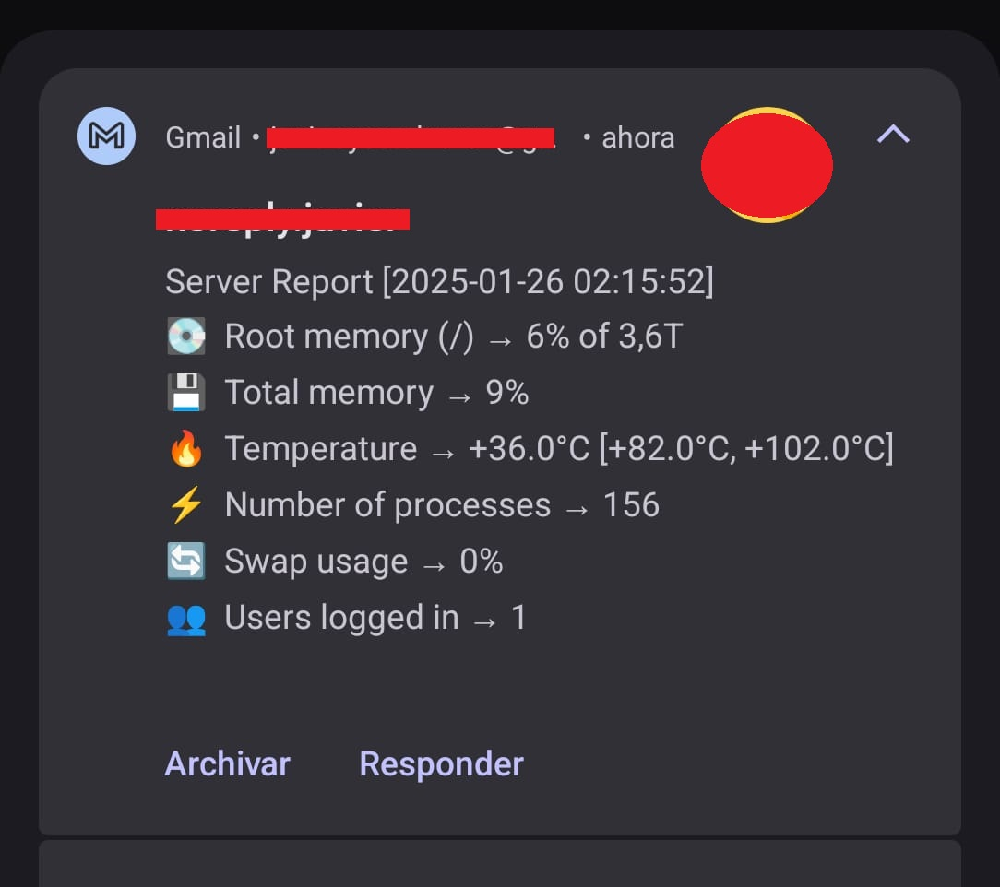

# Server Report

This script generates a server report and sends it via email. It collects various system metrics and formats them into a readable email message.

## Prerequisites

- Python 3.x
- `smtplib` library
- `datetime` library
- `subprocess` library

## Configuration

1. Open `main.py` in a text editor.
2. Update the following variables with your information:
    - `sender`: Your email address.
    - `recipient_list`: A list of recipient email addresses.
    - `my_password`: Your email application password.

## Usage

Run the script using the following command:

```sh
python main.py
```

The script will execute several system commands to gather metrics such as disk usage, memory usage, CPU temperature, process count, swap usage, and the number of users logged in. It will then format this information into an email and send it to the specified recipients.

## Metrics Collected

- **Root memory usage**: Disk usage of the root directory.
- **Total memory usage**: Percentage of used memory.
- **CPU temperature**: Temperature of the CPU cores.
- **Number of processes**: Total number of running processes.
- **Swap usage**: Percentage of used swap memory.
- **Users logged in**: Number of users currently logged in.

## Example Email

<p align="center">
  
</p>


## Troubleshooting

If the email fails to send, ensure that:
- The sender's email and password are correct.
- The recipient email addresses are valid.
- Your email provider allows SMTP access.

## Contributing

This project is open-source so feel free to fork this project and submit pull requests for improvements or new features. Suggestions or enhancements are always welcome!